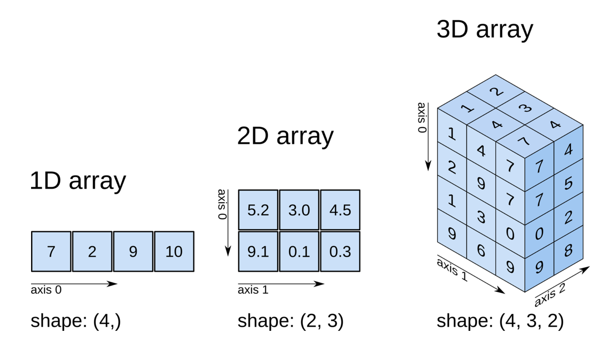

# Introduction à NumPy


[NumPy](https://numpy.org) est une bibliothèque essentielle pour effectuer des calculs numériques en
Python. Elle fournit un support performant pour manipuler des tableaux
multidimensionnels ainsi que pour exécuter diverses opérations mathématiques
associées. Son composant principal, le tableau NumPy, permet de gérer
efficacement les données, ce qui en fait un outil idéal pour les calculs
scientifiques, l'analyse de données et les applications en apprentissage
automatique.

En optimisant les opérations vectorielles, NumPy surpasse les performances des
listes classiques de Python. Elle met également à disposition une large gamme de
fonctions avancées, notamment pour les mathématiques, l'algèbre linéaire, les
transformées de Fourier et bien d'autres domaines.

De plus, NumPy s'intègre harmonieusement avec d'autres bibliothèques populaires
comme [SciPy](https://www.scipy.org) et [Matplotlib](https://matplotlib.org), ce qui en fait une ressource incontournable pour les
professionnels et chercheurs impliqués dans la programmation scientifique en
Python.

## Installation
NumPy est généralement installée par défaut avec les distributions Python. S'il
n'est pas déjà installé, vous pouvez le faire en utilisant l'outil de gestion de
paquets `pip` après **[avoir activé votre environnement](../../notes_exercices.md)** :
```bash
python -m pip install numpy
```


## Tableau NumPy et liste Python

Les tableaux NumPy, également appelés **ndarray** (pour "N-dimensional array")
offrent une gestion des données à la fois flexible et performante.  

Comparés aux listes Python, les tableaux NumPy présentent plusieurs avantages :

- Ils sont généralement plus rapides.  
- Leur structure est plus compacte.  
- Ils prennent en charge des opérations mathématiques vectorisées, rendant les
  calculs plus efficaces.  

Il est essentiel de souligner que, contrairement aux listes Python, les tableaux
NumPy sont homogènes : tous leurs éléments doivent appartenir au même type de
données (par exemple, uniquement des nombres entiers ou uniquement des nombres
flottants).

Les tableaux NumPy peuvent être de dimensions quelconques, mais sont
généralement utilisés pour des tableaux à une, deux ou trois dimensions.


### Performance
Comme mentionné ci-haut, les tableaux NumPy surpassent largement les listes
Python en termes de vitesse, en particulier lorsqu'il s'agit d'effectuer des
calculs mathématiques complexes ou de manipuler de grandes quantités de données.
Cette performance accrue s'explique par l'utilisation d'algorithmes optimisés
écrits en C, un langage de bas niveau qui permet d'accélérer considérablement
l'exécution des opérations.

La vectorisation des opérations est un autre facteur clé de la performance des
tableaux NumPy. En effet, les opérations vectorisées permettent d'effectuer des
calculs sur l'ensemble des éléments d'un tableau en une seule instruction, ce
qui réduit considérablement le temps de traitement.

Le code suivant illustre la différence de performance entre une liste Python et
un tableau NumPy.
```python linenums="1"
import numpy as np
import time

# Créer une grande liste et un tableau NumPy
n = 10000000
lst = list(range(n))  # une liste
arr = np.arange(n)    # un tableau NumPy

# Temps pour la multiplication d'une liste Python
start = time.time()
for i in range(len(lst)):
    lst[i] *= 2
time_python = time.time() - start
print(f"Temps en secondes pour la liste : {time_python:.5f}")

# Temps pour la multiplication d'un tableau NumPy
start = time.time()
arr = arr * 2
time_numpy = time.time() - start
print(f"Temps en secondes pour le tableau NumPy : {time_numpy:.5f}")

print(f"Le tableau NumPy est {time_python / time_numpy:.0f} \
fois plus rapide que la liste Python.")
```

### Taille compacte
Les tableaux NumPy se distinguent par leur grande efficacité en termes de
mémoire, car ils organisent les données dans des blocs de mémoire contigus.
Cette approche minimise la surcharge mémoire souvent liée à la gestion flexible
des types de données dans les listes Python.

Le code suivant illustre la différence de taille entre une liste Python et un
tableau NumPy.
```python linenums="1"
import numpy as np
import sys

n = 1_000_000
lst = [float(i) for i in range(n)]
arr = np.arange(n, dtype=float)

python_list_memory = sys.getsizeof(lst) + sum(sys.getsizeof(x) for x in lst)

numpy_array_memory = arr.nbytes

print(f"Taille de la liste : {python_list_memory} octets")
print(f"Taille du tableau NumPy : {numpy_array_memory} octets")

print(f"Gain : {python_list_memory / numpy_array_memory:.2f}")
```