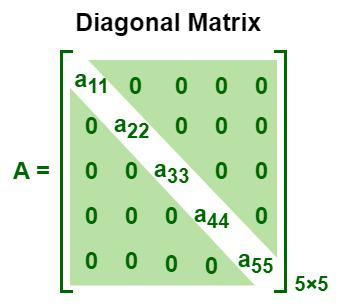

# Création de tableaux NumPy

## Nouveau tableau
On peut utiliser la fonction `np.array()` pour créer un tableau NumPy à partir
d'une liste Python. Par exemple, pour créer un tableau à une dimension:

```python linenums="1"
import numpy as np

# Créer un tableau à une dimension
arr = np.array([1, 2, 3, 4, 5])
animaux = np.array(['chien', 'chat', 'souris', 'oiseau'])

print(arr)
print(animaux)
```

## Nouveau tableau si nécessaire
Lorsqu'on utilise la fonction `np.array()` pour créer un tableau, NumPy génère
systématiquement une **copie des données** et construit un nouveau tableau, même
si l'objet fourni est déjà un tableau NumPy. Cependant, dans certains cas, on
souhaite simplement s'assurer qu'un objet donné est un tableau NumPy, sans créer
de copie inutile si ce n'est pas nécessaire. Pour cela, on peut utiliser la
fonction `np.asarray()`. Cette dernière convertit l'objet en tableau NumPy
uniquement s'il ne l'est pas déjà, évitant ainsi la duplication de données
inutiles.

Par exemple, imaginons une fonction qui calcule la moyenne d'un ensemble de
données, mais qui accepte différents types d'entrées, comme des listes Python,
des tuples ou des tableaux NumPy. Voici comment utiliser `np.asarray()` pour
garantir que l'entrée soit un tableau NumPy, tout en évitant des copies inutiles
:

```python linenums="1"
import numpy as np

def calculer_moyenne(donnees):
    # Convertit les données en tableau NumPy si ce n'est pas déjà le cas
    tableau = np.asarray(donnees)
    return np.mean(tableau)

# Exemples d'utilisation
liste = [1, 2, 3, 4]
tuple_donnees = (5, 6, 7, 8)
tableau_numpy = np.array([9, 10, 11, 12])

print(calculer_moyenne(liste))          # Fonctionne avec une liste
print(calculer_moyenne(tuple_donnees))  # Fonctionne avec un tuple
print(calculer_moyenne(tableau_numpy))  # Fonctionne avec un tableau NumPy
```

### Avantages de `np.asarray()` dans ce contexte :

1. **Flexibilité** : La fonction accepte des types variés (`list`, `tuple`, ou
   `ndarray`) sans erreur.
2. **Efficacité** : Si les données sont déjà un tableau NumPy, aucune copie
   n’est réalisée, ce qui réduit la consommation mémoire et améliore les
   performances.

En résumé, `np.asarray()` est particulièrement utile dans les fonctions
génériques où les types d'entrée peuvent varier et où il est important
d'optimiser la gestion de la mémoire en évitant les copies superflues.

## Copie de tableaux
La fonction `np.copy()` permet de créer une copie indépendante d'un tableau
NumPy. Cette fonction est utile lorsque l'on souhaite modifier un tableau sans
affecter l'original. Par exemple :

```python linenums="1"
import numpy as np

# Créer un tableau
arr = np.array([1, 2, 3, 4, 5])

# Créer une copie du tableau
copie_arr = np.copy(arr)

# Modifier la copie
copie_arr[0] = 100

print(arr)       # [1 2 3 4 5]
print(copie_arr) # [100 2 3 4 5]
```

## Tableaux avec `np.arange()` et `np.linspace()`
NumPy propose également des fonctions pour créer des tableaux de manière
automatique. Par exemple, la fonction `np.arange()` permet de générer une
séquence de nombres régulièrement espacés. Cette fonction est similaire à la
fonction `range()` de Python, mais elle crée directement un tableau NumPy.

```python linenums="1"
import numpy as np

# Créer un tableau de 0 à 9
arr1 = np.arange(10)
print(arr1)  # [0 1 2 3 4 5 6 7 8 9]

# Créer un tableau de 1 à 10
arr2 = np.arange(1, 11)
print(arr2)  # [ 1  2  3  4  5  6  7  8  9 10]

# Créer un tableau de 0 à 10 par pas de 2
arr3 = np.arange(0, 11, 2)
print(arr3)  # [ 0  2  4  6  8 10]
```

La fonction `np.linspace()` permet de créer une séquence de nombres linéairement
espacés. Cette fonction est utile pour générer des valeurs dans un intervalle
donné avec un nombre spécifique de points.

```python linenums="1"
import numpy as np

# Créer un tableau de 5 valeurs linéairement espacées entre 0 et 1
arr = np.linspace(0, 1, 5)
print(arr)  # [0.   0.25 0.5  0.75 1.  ]

# Créer un tableau de 5 valeurs linéairement espacées entre 1 et 0
arr_inverse = np.linspace(1, 0, 5)
print(arr_inverse)  # [1.   0.75 0.5  0.25 0.  ]
```

## Matrices diagonales et identité
La fonction `np.diag()` permet de créer un tableau en deux dimensions avec les
éléments de la diagonale principale spécifiés, et des zéros ailleurs.

<center>
  
</center>

Par exemple :

```python linenums="1"
import numpy as np

# Créer un tableau avec les éléments de la diagonale principale
arr = np.diag([1, 2, 3, 4, 5])
print(arr)
```

La fonction `np.eye()` permet de créer une matrice identité de taille donnée. Par
exemple :

```python linenums="1"
import numpy as np

# Créer une matrice identité de taille 3x3
matrice_identite = np.eye(3)
print(matrice_identite)
```

## Tableaux de zéros et de uns
NumPy propose également des fonctions pour créer des tableaux remplis de zéros ou
de uns. Par exemple, la fonction `np.zeros()` permet de créer un tableau de
dimensions spécifiées rempli de zéros, tandis que la fonction `np.ones()` permet
de créer un tableau rempli de uns.

```python linenums="1"
import numpy as np

# Créer un tableau de dimensions 2x3 rempli de zéros
zeros = np.zeros((2, 3))
print(zeros)

# Créer un tableau de dimensions 3x2 rempli de uns
ones = np.ones((3, 2))
print(ones)
```

## Tableaux aléatoires
NumPy propose également des fonctions pour créer des tableaux aléatoires. Par
exemple, la fonction `np.random.random()` permet de créer un tableau de
dimensions spécifiées rempli de nombres aléatoires entre 0 et 1.

```python linenums="1"
import numpy as np

# Créer un tableau de dimensions 2x2 rempli de nombres aléatoires entre 0 et 1
aleatoire = np.random.random((2, 2))
print(aleatoire)
```

