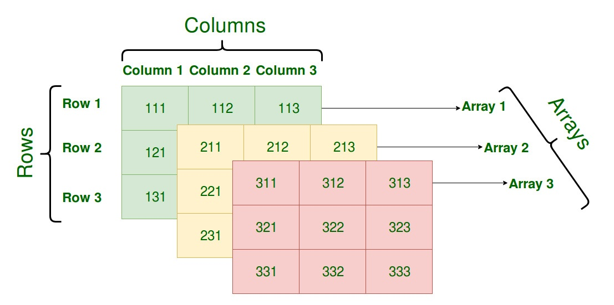

# Tableaux multidimensionnels

Les tableaux NumPy peuvent avoir plusieurs dimensions. Par exemple, un tableau à
une dimension est une liste, un tableau à deux dimensions est une matrice, un
tableau à trois dimensions est un cube, etc.

## 1D (unidimensionnel)

Un tableau unidimensionnel est similaire à une liste Python. Il est créé par exemple à l'aide
de la fonction `np.array()` en passant une liste comme argument. Voir la section
[Création de tableaux NumPy](02_creation_tableau.md) pour des exemples.

## 2D (bidimensionnel)

Un tableau bidimensionnel est similaire à une matrice. Il est créé par exemple à l'aide
de la fonction `np.array()` en passant une liste de listes comme argument.

```python linenums="1"
import numpy as np

# Créer un tableau bidimensionnel
arr = np.array([[1, 2, 3], [4, 5, 6], [7, 8, 9]])

print(arr)

# [[1 2 3]
#  [4 5 6]
#  [7 8 9]]
```

## 3D (tridimensionnel) et plus

Un tableau tridimensionnel est créé à l'aide de la fonction `np.array()` en
passant une liste de listes de listes comme argument.

<center>

</center>

```python linenums="1"
import numpy as np

# Créer un tableau tridimensionnel
arr = np.array([[[1, 2], [3, 4]], [[5, 6], [7, 8]]])

print(arr)

# [[[1 2]
#   [3 4]]
#
#  [[5 6]
#   [7 8]]]
```

## Fonction `ndim`
La fonction `ndim` permet de connaître le nombre de dimensions d'un tableau.

```python linenums="1"
import numpy as np

# Créer un tableau unidimensionnel
arr1 = np.array([1, 2, 3])
print(arr1.ndim)  # 1

# Créer un tableau bidimensionnel
arr2 = np.array([[1, 2], [3, 4]])
print(arr2.ndim)  # 2

# Créer un tableau tridimensionnel
arr3 = np.array([[[1, 2], [3, 4]], [[5, 6], [7, 8]]])
print(arr3.ndim)  # 3
```

## Fonctions NumPy
Les fonctions que nous avons abordées précédemment, telles que `np.zeros`,
`np.random`, `np.random.random`, `np.ones`, etc., offrent un moyen simple de
créer des tableaux multidimensionnels. Pour définir les dimensions du tableau,
il suffit de fournir un tuple représentant sa "forme" (ou "shape" en anglais) en
paramètre.

```python linenums="1"
import numpy as np

# Créer un tableau de dimensions 2x3x4 rempli de zéros
zeros = np.zeros((2, 3, 4))
print(zeros)

# Créer un tableau de dimensions 3x2x2 rempli de uns
ones = np.ones((3, 2, 2))
print(ones)

# Créer un tableau de dimensions 2x2x2 rempli de nombres aléatoires entre 0 et 1
aleatoire = np.random.random((2, 2, 2))
print(aleatoire)
```

## Accès aux éléments
L'accès aux éléments d'un tableau multidimensionnel se fait en spécifiant les
indices de chaque dimension séparés par des virgules. Par exemple, pour accéder
à l'élément à la première ligne et à la deuxième colonne d'une matrice, on
utilise l'index `[0, 1]`.

```python linenums="1"
import numpy as np

# Créer un tableau bidimensionnel
arr = np.array([[1, 2, 3], [4, 5, 6], [7, 8, 9]])

# Accéder à l'élément à la première ligne et à la deuxième colonne
print(arr[0, 1])  # 2
```

## Tranches (slices)
Les tranches (slices) fonctionnent de la même manière que pour les tableaux à une
dimension. On peut spécifier des tranches pour chaque dimension en les séparant
par des virgules. Par exemple, pour extraire la première colonne d'une matrice,
on utilise `[:, 0]`.

```python linenums="1"
import numpy as np

# Créer un tableau bidimensionnel
arr = np.array([[1, 2, 3], [4, 5, 6], [7, 8, 9]])

# Extraire la première colonne
print(arr[:, 0])  # [1 4 7]
```

## Indexation booléenne
L'indexation booléenne fonctionne également de la même manière que pour les
tableaux à une dimension. On peut utiliser des tableaux de booléens pour
sélectionner des éléments spécifiques d'un tableau multidimensionnel.

```python linenums="1"
import numpy as np

# Créer un tableau bidimensionnel
arr = np.array([[1, 2, 3], [4, 5, 6], [7, 8, 9]])

# Créer un tableau de booléens
masque = np.array([[True, False, True], [False, True, False], [True, False, True]])

# Sélectionner les éléments correspondant à True
print(arr[masque])  # [1 3 5 7 9]
```

On peut également obtenir un masque booléen en utilisant des opérateurs de
comparaison, par exemple pour sélectionner les éléments supérieurs à 5 :

```python linenums="1"
import numpy as np

# Créer un tableau bidimensionnel
arr = np.array([[1, 2, 3], [4, 5, 6], [7, 8, 9]])

# Créer un masque booléen
masque = arr > 5

# Sélectionner les éléments supérieurs à 5
print(arr[masque])  # [6 7 8 9]
```

## Multiplication élément par élément
Pour multiplier deux tableaux élément par élément, on utilise l'opérateur `*`.

```python linenums="1"
import numpy as np

# Créer deux matrices
A = np.array([[1, 2], [3, 4]])
B = np.array([[5, 6], [7, 8]])

# Multiplication élément par élément
produit = A * B

print(produit)
```

## Produit matriciel
Pour obtenir le produit matriciel de deux matrices `A` et `B`, on
utilise `np.dot(A, B)`.

!!! warning "Attention"
    Pour que le produit matriciel soit possible, le nombre de colonnes de la
    première matrice doit être égal au nombre de lignes de la deuxième matrice.

```python linenums="1"
import numpy as np

# Créer deux matrices
A = np.array([[1, 2, 3], [4, 5, 6]])
B = np.array([[7, 8], [9, 10], [11, 12]])

# Produit matriciel
produit = np.dot(A, B)

print(produit)
```

## Aplatissement
Pour aplatir un tableau multidimensionnel, on utilise la méthode `flatten()`.

```python linenums="1"
import numpy as np

# Créer un tableau bidimensionnel
arr = np.array([[1, 2, 3], [4, 5, 6], [7, 8, 9]])

# Aplatir le tableau
aplati = arr.flatten()

print(aplati)
```

Il est également possible d'utiliser la méthode `ravel()` pour aplatir un
tableau multidimensionnel. La différence entre `flatten()` et `ravel()` est que
`flatten()` renvoie une copie du tableau, tandis que `ravel()` renvoie une vue
sur le tableau d'origine.

## Redimensionnement
Pour redimensionner un tableau, on utilise la méthode `reshape()`.

```python linenums="1"
import numpy as np

# Créer un tableau unidimensionnel
arr = np.array([1, 2, 3, 4, 5, 6])

# Redimensionner le tableau en une matrice 2x3
matrice = arr.reshape(2, 3)

print(matrice)
```

## Transposition
La transposition d'une matrice s'obtient en utilisant la fonction
`np.transpose()`. Pour rappel la transposée d'une matrice est obtenue en
échangeant les lignes et les colonnes.

```python linenums="1"
import numpy as np

# Créer une matrice
A = np.array([[1, 2], [3, 4], [5, 6]])

# Transposer la matrice
transposee = np.transpose(A)
print(transposee)
```